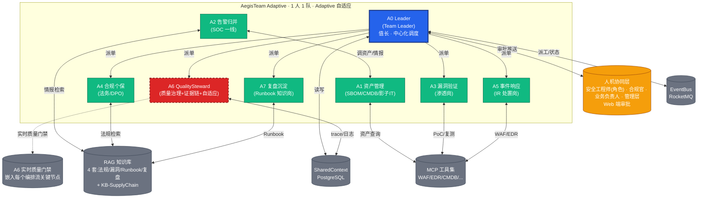

# AegisTeam Adaptive · AgentTeams 编排流与 Mock 演示剧本

> 适用对象:GOAI 赛道一·Agent Infra 评审材料
> 配套文档:`00-overview.md`(项目叙事)/ `01-agents-and-skills.md`(8 岗位身份 + 23 Skill 详细定义)/ `03-skill-catalog.md`(Skill 索引)
> 核心叙事:1 个安全工程师(角色) + 8 个 Agent = 1 个具备 7×24 能力的小型 SOC 团队
> 文档版本:V1.1 / 2026-08-16(同步对齐 01 中 A0 Leader / A6 QualitySteward 职责升级)

---

## 一、协同编排总则

### 1.1 编排框架
AegisTeam Adaptive 基于 **AgentTeams (Hiclaw, hiclaw.io)** 实现多 Agent 协同。在 AgentTeams 概念中,A0 担任 **Team Leader** 角色,负责把来自四面八方的任务(告警、监管通报、新法规事件、巡检请求、应急工单)分派给合适的 Agent,跟踪执行进度,升级阻塞,日终汇总;其他 7 个 Agent 各司其职,通过共享上下文(SharedContext Store)+ 事件总线(EventBus)通信。所有编排遵循以下原则:

- **中心化 Leader + 分布式协作**:**A0 Leader Agent** 负责事件入口、派工、升级、关闭;其他 7 个 Agent 各司其职,通过共享上下文(SharedContext Store)+ 事件总线(EventBus)通信。
- **A6 实时质量治理**:**A6 QualitySteward** 不再只是"事后留痕",而是以"实时质量治理 Agent + 证据链完整性 Agent + 自适应反馈 Agent"三重身份嵌入每一编排流的关键节点(关键决策前、关键变更前、闭环前),对每一步进行质量门禁检查、证据链预固化、流程偏差检测,发现偏差时触发自适应反馈,推动 A0 Leader 调整 Skill。
- **状态共享**:所有 Agent 写入 `shared-context-store`(PostgreSQL + PolarDB,Mock 阶段用 JSON 文件),关键事件通过 `event-bus`(RocketMQ,Mock 阶段用 Redis Stream)广播。
- **可观测**:每一次 Agent 调用、Skill 执行、状态变更都产生 trace(AgentScope Studio 收集),可在团队大屏实时回放。
- **4 级安全执行分级**(严格一致,贯穿所有编排流):
  - **L0** 只读:查询/分析/报告,自动执行
  - **L1** 低风险自动:在沙箱/测试环境/可逆操作,自动执行
  - **L2** 灰度+审批:影响生产/对外可见/不可逆,必须 1 名对应角色审批
  - **L3** 仅规划:高破坏性/合规未确认/法务未授权,Agent 仅生成方案,人工执行

### 1.2 编排通用步骤描述模板
每条编排流的步骤统一采用:
`Step N | Agent | Skill | L级 | 上下文输入 → 上下文输出 | 状态变化`

### 1.3 审批关口命名规范
- **H1** 事实确认关:在响应执行前,确认"漏洞/事件/违规事实成立"
- **H2** 执行审批关:在生产变更前,确认"响应方案/整改方案/对外通知可执行"
- 不同编排流共享这两个关口名,便于 Mock 大屏统一呈现。

### 1.4 A6 QualitySteward 三重身份与新 Skill 索引(本文档引用)
| 身份 | 职责 | 引用 Skill 名 | L级 |
|---|---|---|---|
| 实时质量治理 Agent | 在关键节点(关键决策前/关键变更前/闭环前)做质量门禁检查,发现流程偏差即推送 A0 Leader | `quality_governance.check` | L0 |
| 证据链完整性 Agent | 对 L1+ 操作做证据预固化(链式 Hash + 时间戳),在审批前先固化事实,防止"先批后造" | `evidence_chain.anchor` | L0 |
| 自适应反馈 Agent | 对 A0 Leader 的派工/A1-A5 的执行做偏差检测,触发 Skill 调整或重新派单 | `adaptive_feedback.trigger` | L0 |
| 证据采集 Agent(沿用) | 事件闭环后打包完整证据包 | `evidence.chain.collect` | L0 |
| 操作留痕 Agent(沿用) | 全链路审计日志 | `operation.audit` | L0 |
| 报告生成 Agent(沿用) | 审计/事件/通报报告 | `audit.report.generate` | L0 |

> 说明:上述 `quality_governance.check` / `evidence_chain.anchor` / `adaptive_feedback.trigger` 为 A6 新增 3 个 Skill 的引用名,与 01-agents-and-skills.md 同步定义(在 8 岗位 + 23 Skill 体系内,以"扩展 Skill"形式登记,目标数从 23 扩展到 26)。

---

## 二、3 类编排流详细设计

### 编排流 1:告警触发流(Alert-Driven)

> **典型场景**:SIEM/EDR/WAF 推送一条"Web 应用存在 SQL 注入"高危告警,需要从告警归并到响应闭环,30 分钟内完成临时缓解。
> **调动 Agent 数**:6 个(A0 Leader + A1 + A2 + A3 + A5 + A6 QualitySteward),共 22 步。

#### 2.1.1 触发条件
- SIEM(Splunk/QRadar,Mock 阶段用 `mock-siem-adapter`)推送级别 ≥ P2 的告警
- WAF 检测到 OWASP Top 10 攻击载荷
- EDR 上报主机可疑行为
- 触发入口:`event-bus` 主题 `alert.raw.inbound`,载荷含 `alert_id, severity, source, asset_hint`

#### 2.1.2 协同步骤(共 22 步)

| Step | Agent | Skill | L级 | 上下文输入 → 输出 | 状态变化 |
|---|---|---|---|---|---|
| 1 | A0 Leader | `orchestrator.incident.create` | L0 | `alert.raw` → `incident.draft{INC-yyyymmdd-NNN, status=DRAFT, severity=P2}` | 事件状态:DRAFT |
| 2 | A0 Leader | `orchestrator.dispatch` | L0 | `incident.draft` → 派单 `task=A2.triage` | 派工队列 +1 |
| 3 | A2 告警归并 | `alert.correlate.merge` | L0 | 调 RAG(情报库)+ A1 资产关联服务 → `incident.draft.correlated{related_cve[], related_assets[], dedup_group_id}` | 状态:TRIAGED |
| 4 | A2 告警归并 | `alert.tier.score` | L0 | 输入 `correlated` → 输出 `severity_final=P1`(因关联到 2026-08 新披露 CVE) | 状态:TRIAGED, severity=P1 |
| 5 | A2 告警归并 | `alert.false_positive.check` | L0 | 调用 RAG(历史误报库)+ 行为基线 → 排除 FP,产出 `fp_score=0.02` | 状态:TRIAGED, fp_score |
| **6** | **A6 QualitySteward** | **`quality_governance.check` ①** | **L0** | **归并后质量门禁:校验归并报告完整性、CVE 关联正确性、分级合理性、证据链节点已就位 → 输出 `qa_gate{passed=true, issues=[]}`,作为派单 A3 的"准入证"** | **状态:QA_PASSED_1** |
| 7 | A0 Leader | `orchestrator.dispatch` | L0 | 派单 `task=A3.validate`,参数 `poc_target=cve-2026-xxxxx`,要求必须携带 QA 准入证 | 派工队列 +1 |
| 8 | A3 漏洞验证 | `vuln.poc.synthesize` | L0 | 输入 CVE → RAG 检索 + Skill 生成 PoC 草稿 | PoC 草稿生成 |
| 9 | A3 漏洞验证 | `vuln.poc.execute` | **L1**(沙箱内) | 在隔离沙箱执行 PoC,目标为受影响资产镜像 → 输出 `vuln_report{confirmed=true, exploitability=HIGH, blast_radius=...}` | 状态:VALIDATED |
| **10** | **A6 QualitySteward** | **`evidence_chain.anchor` ①** | **L0** | **在 L2 审批之前对 PoC 报告、合规事实、影响资产清单做证据预固化(链式 Hash + 时间戳),防止"先批后造",输出 `evidence_anchor{hash_chain=..., ts=...}`** | **状态:ANCHORED_1** |
| 11 | A0 Leader | `orchestrator.dispatch` | L0 | 派单 `task=A5.respond`,参数 `mode=incident` | 派工队列 +1 |
| 12 | A5 响应 | `ir.plan.generate` | L0 | 输入 `incident + vuln_report + evidence_anchor` → 输出 `response_plan{temporary_mitigation=WAF规则, permanent_fix=补丁升级, rollback=回滚版本}` | 状态:PLANNED |
| **13** | **A0 Leader** | **`orchestrator.approval.request`** | **L2** | **推送审批卡 H1 + H2 合并(告警场景合并为单关口)到安全工程师(角色) Web 端,审批材料含 `vuln_report + response_plan + evidence_anchor`** | **状态:AWAITING_APPROVAL** |
| 14 | 安全工程师(角色) | (人工)审批 | L2 | 审批结果回写 `incident.approval{approved=true, approver_role=安全工程师, ts=...}` | 状态:APPROVED |
| 15 | A5 响应 | `ir.mitigate.waf` | **L1**(WAF 下发,分钟级回滚) | 调用 MCP 工具 `waf-rule-deploy`(Mock),目标 `rule_id=auto-gen` → 输出 `waf_rule_id, applied_at` | 状态:MITIGATED |
| 16 | A5 响应 | `ir.notify.devteam` | L0 | 调 RAG(联系人库)+ 企业微信 MCP → 通知开发团队负责人 | 状态:NOTIFIED |
| 17 | A0 Leader | `orchestrator.dispatch` | L0 | 派单 `task=A3.retest` | 派工队列 +1 |
| 18 | A3 漏洞验证 | `vuln.retest` | L1 | 沙箱重放原始 PoC,确认 WAF 已拦截 → `retest_report{mitigated=true}` | 状态:VERIFIED |
| 19 | A0 Leader | `orchestrator.dispatch` | L0 | 派单 `task=A6.evidence` | 派工队列 +1 |
| 20 | A6 QualitySteward | `evidence.chain.collect` + `quality_governance.check` ② | L0 | 拉取全链路 trace + 日志 + 截图 + 审批单 + 两次 evidence_anchor → 闭环前质量门禁检查 → `evidence_bundle.zip` | 状态:EVIDENCED |
| 21 | A6 QualitySteward | `audit.report.generate` + `adaptive_feedback.trigger` | L0 | 生成 `incident_report.pdf`(含时间线/审批/响应动作);同步检查全流程是否有偏差(SLA、审批超时、误派等)→ 如有偏差输出 `feedback{target_skill, adjust_action}` 推 A0 Leader | 状态:REPORTED |
| 22 | A0 Leader | `incident.close` | L0 | 关闭事件,处理 A6 自适应反馈(若有),触发 A7(异步,见流 3) | 状态:CLOSED |

#### 2.1.3 并发 / 串行
- **可并发**:Step 3-5(A2 内部归并+分级+误报识别三任务并发)、Step 20-21(A6 证据采集 + 报告生成 + 自适应反馈并发)
- **必须串行**:Step 6 → 7(质量门禁未过不允许派 A3)、Step 9 → 10(必须 A3 验证完毕才能做证据预固化)、Step 10 → 12(证据已固化才能进 A5 规划)、Step 12 → 13(方案必须先生成才能审批)、Step 15 → 18(必须先下发 WAF 才能复测)

#### 2.1.4 审批关口
- **H1+H2 合并**(告警场景):Step 13,需要 1 名安全工程师(角色)审批
  - 审批内容:`vuln_report + response_plan + evidence_anchor`(事实+方案+证据预固化合并展示)
  - 审批超时:30 分钟未响应 → 自动升级到备审批角色 + 推送企业微信告警

#### 2.1.5 异常分支
- **Step 5 FP 高分**(`fp_score > 0.7`):直接关闭事件,生成 FP 标签,加入 RAG 误报库
- **Step 6 质量门禁不通过**:A6 QualitySteward 列出 issue 清单(归并报告字段缺失 / CVE 关联错误 / 分级不合理),A0 Leader 重新派单 A2 补做,回到 Step 3
- **Step 9 PoC 执行超时/失败**:自动重试 1 次,仍失败 → 升级到 A7 复盘(可能是 PoC 不成熟,不是漏洞不存在)
- **Step 14 审批被驳回**:A5 重新生成方案 → 回到 Step 12
- **Step 15 WAF 下发失败**:回滚到 Step 12 重选临时缓解(如 IP 封禁),或升级 L3
- **Step 18 复测失败**:回到 Step 11,重新规划响应,触发二轮 H1+H2 审批
- **Step 21 A6 自适应反馈触发**:A0 Leader 收到 `feedback{adjust_action=...}` 后,在线更新对应 Skill 参数(如告警分级阈值、SLA 时长)→ 不需重启 Agent 即可生效

---

### 编排流 2:监管通报流(Regulator-Notice-Driven)

> **典型场景**:收到网信办/工信部/公安网监的整改通报,要求 N 个工作日内完成整改并回执。需走完 2 个独立审批关口(H1 事实确认 + H2 整改执行),合规/安全工程师(角色)双签。
> **调动 Agent 数**:6 个(A0 Leader + A1 + A3 + A4 + A5 + A6 QualitySteward),共 26 步。

#### 2.2.1 触发条件
- 监管邮件/公文系统(对接 网信办/工信部)推送通报
- 触发入口:`event-bus` 主题 `regulator.notice.inbound`,载荷含 `notice_id, regulator, deadline, content`
- **必须立即冻结 A5 的生产变更**,进入"通报优先"模式

#### 2.2.2 协同步骤(共 26 步)

| Step | Agent | Skill | L级 | 上下文输入 → 输出 | 状态变化 |
|---|---|---|---|---|---|
| 1 | A0 Leader | `orchestrator.regulator.intake` | L0 | `notice.raw` → `notice_record{REG-yyyymmdd-NNN, deadline, regulator, raw_text}` | 工单状态:INTAKED |
| 2 | A0 Leader | `notice.parse` | L0 | RAG(通报模板库)+ LLM 解析 → `notice.facts{affected_systems[], violation_clauses[], deadline_business_days}` | 状态:PARSED |
| 3 | A0 Leader | `orchestrator.dispatch` | L0 | 派单 `task=A1.asset.locate` | 派工队列 +1 |
| 4 | A1 资产管理 | `asset.query` | L0 | 输入受影响系统关键词 → 输出 `asset_list{id, ip, owner, sbom_hash, exposure}` | 状态:ASSETS_LOCATED |
| 5 | A0 Leader | `orchestrator.dispatch` | L0 | 派单 `task=A4.compliance.check` | 派工队列 +1 |
| 6 | A4 合规个保 | `compliance.clause.match` | L0 | RAG(法规库)+ `notice.facts` → `compliance_report{clauses: [等保2.0-8.1.4.2, 个保法-第13条], severity=HIGH}` | 状态:COMPLIANCE_CHECKED |
| 7 | A4 合规个保 | `compliance.pii.assess` | L0 | 调 A1 拉取受影响系统数据流图 → `pii_impact{contains_pii=true, categories:[身份证,手机号]}` | 状态:PII_ASSESSED |
| **8** | **A6 QualitySteward** | **`quality_governance.check` ①** | **L0** | **事实汇总前质量门禁:校验资产/合规/PII 三份报告完整性、跨报告一致性(如 affected_systems 与 asset_list 对齐)、通报条款引用准确性 → 输出 `qa_gate{passed=true, issues=[]}`,作为 H1 审批的"准入证"** | **状态:QA_PASSED_1** |
| **9** | **A0 Leader** | **`orchestrator.approval.request`** | **L2** | **H1 关口:事实确认(系统/条款/影响范围),需要合规官 + 安全工程师(角色)双签** | **状态:AWAITING_H1** |
| 10 | 合规官 + 安全工程师(角色) | (人工)双签 | L2 | 审批回写 `notice.h1.approval{...}` | 状态:H1_APPROVED |
| 11 | A0 Leader | `orchestrator.dispatch` | L0 | 派单 `task=A3.validate`(若通报涉及技术漏洞) | 派工队列 +1 |
| 12 | A3 漏洞验证 | `vuln.poc.execute` | L1 | 沙箱内复现通报中描述的漏洞 | 状态:VALIDATED |
| **13** | **A6 QualitySteward** | **`evidence_chain.anchor` ①** | **L0** | **整改前证据预固化:对 PoC 报告、资产快照、合规报告做链式 Hash + 时间戳,作为"整改前事实基线",防止事后争议"到底改前是什么状态"** | **状态:ANCHORED_1** |
| 14 | A0 Leader | `orchestrator.dispatch` | L0 | 派单 `task=A5.remediate` | 派工队列 +1 |
| 15 | A5 响应 | `ir.remediation.plan` | L0 | 输入 `notice + asset_list + compliance_report + vuln_report + evidence_anchor` → `remediation_plan{temp=..., permanent=..., deadline=..., rollback=...}` | 状态:PLANNED |
| **16** | **A0 Leader** | **`orchestrator.approval.request`** | **L2** | **H2 关口:整改执行审批,需要安全工程师(角色) + 业务负责人 + 合规官三方会签** | **状态:AWAITING_H2** |
| 17 | 安全工程师(角色) + 业务负责人 + 合规官 | (人工)三方会签 | L2 | 审批回写 `notice.h2.approval{...}` | 状态:H2_APPROVED |
| 18 | A5 响应 | `ir.mitigate.network` / `ir.mitigate.host` | L1 | 执行临时缓解(网络封禁/主机隔离) | 状态:TEMP_MITIGATED |
| 19 | A5 响应 | `ir.remediate.execute` | **L1** | 执行永久修复(打补丁/配置加固),所有动作有快照可回滚 | 状态:REMEDIATED |
| 20 | A0 Leader | `orchestrator.dispatch` | L0 | 派单 `task=A3.retest` | 派工队列 +1 |
| 21 | A3 漏洞验证 | `vuln.retest` | L1 | 沙箱复测,确认漏洞关闭 | 状态:VERIFIED |
| 22 | A0 Leader | `orchestrator.dispatch` | L0 | 派单 `task=A6.evidence` | 派工队列 +1 |
| 23 | A6 QualitySteward | `evidence.chain.collect` + `quality_governance.check` ② | L0 | 拉取 H1+H2 审批单 + 整改前后对比截图 + 复测报告 + 两次 evidence_anchor → 闭环前质量门禁(检查整改是否真的"对得上"通报条款)→ `evidence_bundle` | 状态:EVIDENCED |
| 24 | A6 QualitySteward | `audit.report.regulator` + `adaptive_feedback.trigger` | L0 | 生成 `regulator_reply.pdf`(格式符合网信办模板);同步检查通报处理全流程偏差(SLA、deadline 预警、合规条款覆盖度)→ 输出 `feedback` 推 A0 Leader | 状态:REPORTED |
| 25 | A0 Leader | `notice.submit` | L0 | 调用公文系统 MCP(Mock)提交回执 | 状态:SUBMITTED |
| 26 | A0 Leader | `notice.close` | L0 | 关闭通报工单,处理 A6 自适应反馈(若有),异步触发 A7 复盘 | 状态:CLOSED |

#### 2.2.3 并发 / 串行
- **可并发**:Step 4 + 6(A1 资产定位 与 A4 合规条款匹配 可并行,因为 A4 只需事实列表,不依赖资产详情)
- **必须串行**:Step 7 → 8(事实必须齐备才能质量门禁)、Step 8 → 9(质量门禁通过才能进 H1 审批)、Step 9 → 10 → 11(H1 审批通过才能让 A3 验证)、Step 12 → 13(验证完成才能做证据预固化)、Step 15 → 16(方案必须先生成才能 H2 审批)、Step 18 → 19(临时缓解必须先于永久修复)、Step 21 → 23(复测通过才能生成证据)

#### 2.2.4 审批关口
- **H1 事实确认关**(Step 9):合规官 + 安全工程师(角色)双签,审批"通报中描述的事实是否真实存在"
- **H2 执行审批关**(Step 16):安全工程师(角色) + 业务负责人 + 合规官三方会签,审批"整改方案是否可执行、是否影响业务、是否满足监管要求"
- **H1 vs H2 严格分离**:H1 不通过则不进入整改规划;H2 不通过则方案回炉;两者不可合并审批
- **A6 质量门禁为 H1/H2 必经前置步骤**(Step 8 / Step 23):未通过 A6 质量门禁的,不得进入对应审批关口

#### 2.2.5 异常分支
- **Step 4 资产未找到**:A1 触发"影子 IT 扫描"(Mock 返回 0 命中),A0 Leader 推送安全工程师(角色)人工确认,可能升级 L3
- **Step 8 质量门禁不通过**:A6 列出 issue 清单(如资产清单与通报描述不一致、条款引用错误),A0 Leader 重新派单 A1/A4 补做,回到 Step 3
- **Step 10 H1 被驳回**:A0 Leader 重新派单 A1/A4 补充调查,回到 Step 3
- **Step 12 PoC 不可复现**:通报所述漏洞不存在 → 升级 A7 复盘,生成"通报事实争议"报告,安全工程师(角色)决定是否回执澄清
- **Step 17 H2 被驳回**:A5 重做方案,可能因业务影响过大需要拆分,回到 Step 15
- **Step 19 永久修复失败**:自动回滚到修复前快照(由 Step 13 evidence_anchor 固化),升级 L3 安全工程师(角色)手工处置
- **Step 21 复测不通过**:重新进入整改规划循环,通报 deadline 临近则触发"加急"标签
- **Step 24 A6 自适应反馈触发**:A0 Leader 收到 `feedback{adjust_action=...}` 后,在线更新相关 Skill 参数(如通报处理 SLA、合规条款映射规则)
- **deadline 预警**:距 deadline < 48h 仍未完成,自动推送加急告警到安全工程师(角色) + 合规官

---

### 编排流 3:新法规响应流 (New-Regulation-Response)

> **典型场景**:监管发布新法规(如 2026-08 工信部发布《数据出境新管理办法》)/ 内部发布新业务(如上线新 SaaS 服务,自动触发"哪些法规适用"扫描),需要同时走"管理路"(起草本单位合规管理办法)和"技术路"(资产/漏洞/响应预案联动排查),最终形成"全单位合规落地报告"并接受管理层审批。
> **调动 Agent 数**:**7 个**(A0 Leader + A1 + A3 + A4 + A5 + A6 QualitySteward + A7),共 14 步,管理路 + 技术路双线并发。
> **A6 参与**:A6 QualitySteward 必参与(质量治理 Agent 是 Adaptive 的关键,体现"实时质量治理"贯穿所有编排流)。

#### 2.3.1 触发条件
- **新法规发布**(自动捕获):
  - 网信办 / 工信部 / 公安部 / 国家密码局等 RSS 订阅触发新法规推送
  - 法规库 diff 监控发现与已有库差异超阈值
  - 合规官手动录入新法规
- **新业务发布**(自动触发):
  - A1 资产管理 Agent 入库新业务系统时,自动触发"哪些法规适用"扫描
  - 业务部门提交"新业务上线申请"
- **触发入口**:`event-bus` 主题 `regulation.new.issued`,载荷含 `event_id, source, type={new_regulation|new_business}, content, ts`

#### 2.3.2 协同步骤(共 14 步,管理路 + 技术路双线)

| Step | Agent | Skill | L级 | 上下文输入 → 输出 | 状态变化 |
|---|---|---|---|---|---|
| 1 | A0 Leader | `orchestrator.regulation.intake` | L0 | `regulation.new.issued` 事件 → `regulation_task{REG-NEW-yyyymmdd-NNN, source, type, raw_content}` | 任务入队 |
| 2 | A0 Leader | `orchestrator.dispatch` | L0 | 派单 `task=A4.regulation.parse` | 派工队列 +1 |
| 3 | A4 合规个保 | `regulation.clause.decompose` | L0 | 调 RAG(法规库,含 KB-SupplyChain 供应链合规子库)+ LLM 拆解 → `regulation.facts{articles[], effective_date, scope, obligations[], penalty}` | 状态:PARSED |
| 4 | A4 合规个保 | `regulation.requirement.generate` | L0 | 基于拆解结果生成"新要求清单" → `requirement_list{管理类:[...], 技术类:[...], 资产类:[...], 漏洞类:[...], 响应类:[...]}`,作为派工 A1/A3/A5 的依据 | 清单生成 |
| 5 | A4 合规个保 | `regulation.policy.draft` | **L1**(自动起草) | **管理路:起草《本单位合规管理办法草案》 → `policy_draft{title, scope, clauses, transition_plan}`** | 草案就绪 |
| 6 | A0 Leader | `orchestrator.dispatch` | L0 | 技术路:并发派单 `task=A1.asset.scan` / `task=A3.vuln.scan` / `task=A5.irplan.adjust` | 派工队列 +3(并发) |
| 7 | A1 资产管理 | `asset.shadow_it.scan` + `asset.query` | L0 | 按 requirement_list 资产类要求 → 资产/影子 IT 排查方案 → `asset_impact_report{affected_assets[], shadow_it_risks[], exposure_changes[]}` | 状态:ASSET_SCANNED |
| 8 | A3 漏洞验证 | `vuln.cve.match` + `vuln.verify` | L0 | 按 requirement_list 漏洞类要求 → 漏洞/CVE 排查方案 → `vuln_impact_report{related_cves[], exposure_assets[], severity}` | 状态:VULN_SCANNED |
| 9 | A5 事件响应 | `ir.plan.adjust` | L0 | 按 requirement_list 响应类要求 → 响应预案调整 → `ir_plan_delta{new_playbook, modified_playbook, training_needs[]}` | 状态:IR_ADJUSTED |
| 10 | A4 合规个保 | `regulation.compliance.consolidate` | L0 | **汇总管理路(policy_draft)+ 技术路(asset/vuln/ir 三份报告),生成"全单位合规落地报告" → `landing_report{policy_draft, tech_actions, gap_items, roadmap, deadline}`** | 状态:CONSOLIDATED |
| 11 | A6 QualitySteward | `quality_governance.check` ③ + `evidence_chain.anchor` ② | L0 | 审计流程合规性:校验 policy_draft 条款是否对应新法规原文 / 技术路 3 份报告是否完整 / 落地报告与新要求清单是否对齐;对 landing_report 做证据预固化 → `qa_report{passed, issues, evidence_anchor}` | 状态:QA_PASSED_2 + ANCHORED_2 |
| 12 | A7 复盘沉淀 | `runbook.regland.gen` | L0 | 基于 landing_report + 历史新法规落地案例 → 生成"新法规如何落地"Runbook 条目,沉淀到 RAG Runbook 库 → `runbook_entry{title="新法规 X 落地标准操作", version=v1}` | 知识更新 |
| **13** | **A0 Leader** | **`orchestrator.approval.request`** | **L2** | **H2 关口:管理层最终审批,需要管理层审批 landing_report(管理路 + 技术路 + Runbook 沉淀一并提交)** | **状态:AWAITING_H2_MGT** |
| 14 | A0 Leader | `regulation.report.push` + `regulation.task.close` | L0 | 推送 landing_report 给管理层(企业微信 MCP)+ 合规官 + 各业务部门;关闭新法规响应任务,异步触发 A7 持续跟踪(30/60/90 天落地复盘) | 状态:CLOSED |

#### 2.3.3 并发 / 串行
- **可并发**:Step 7 + 8 + 9(A1 资产扫描、A3 漏洞扫描、A5 预案调整 三任务严格并发,均只依赖 requirement_list,互不依赖)
- **必须串行**:Step 3 → 4(必须先拆解才能生成清单)、Step 4 → 5 与 Step 4 → 6(清单生成后才能分管理路/技术路)、Step 5/6 → 10(管理路草案 + 技术路三报告都齐了才能汇总)、Step 10 → 11(汇总后必须先做 A6 质量门禁才能进 A7 与审批)、Step 11 → 12(质量门禁通过才能沉淀 Runbook)、Step 12 → 13(Runbook 沉淀后才能推管理层)

#### 2.3.4 审批关口
- **H1 管理办法审批**(Step 5 后,合并到 Step 11 之前处理):**L2**,合规官审批 policy_draft(管理办法草案)
  - 审批材料:`policy_draft` + 新法规原文 + requirement_list
  - 审批结果回写 `policy.h1.approval{...}`
- **H2 管理层最终审批**(Step 13):**L2**,管理层审批 landing_report
  - 审批材料:`landing_report`(含 policy_draft + 技术路三报告 + 落地路线图) + `qa_report` + `runbook_entry`
  - 审批超时:48 小时未响应 → 自动升级到分管副总 + 推送企业微信告警

#### 2.3.5 异常分支
- **Step 3 法规拆解失败**(法规无条款可匹配 / RAG 法规库缺失):A4 标记"待人工拆解",升级 A0 Leader → 推送合规官人工拆解 → 重新触发 Step 3
- **Step 5 管理办法草案生成失败**(LLM 拒答 / 模板加载失败):A4 降级为"基于历史最相似法规生成占位草案",标"待人工补充" → Step 6 仍可继续派技术路
- **Step 7/8/9 技术路任一 Agent 排查失败**:A0 Leader 重派(最多 3 次),3 次失败升级到 A7 复盘 + 推送安全工程师(角色)人工介入;其他两个 Agent 不阻塞,继续推进
- **H1 管理办法审批被驳回**:A4 重新起草 → 回到 Step 5
- **H2 管理层最终审批被驳回**:A4 + A0 Leader 拆分执行,部分条款先落地(高优先级),剩余条款降级为"季度复盘跟踪项" → 在 landing_report 中标注"已拆分执行 + 跟踪项"
- **Step 11 A6 审计发现流程偏差**(policy_draft 与新法规条款不匹配 / 技术路报告缺失 / 证据链不完整):A6 触发 `adaptive_feedback.trigger` → A0 Leader 在线调整对应 Skill 参数(如条款映射规则、报告模板),并要求相关 Agent 补做 → 回到对应 Step 重做
- **Step 12 Runbook 沉淀冲突**:A7 标记冲突条目,推送给安全工程师(角色)人工合并(参考编排流 3 旧版处理方式)
- **整周期无新法规**(理想态):A7 仍产出"无新法规运行周报",作为正向指标写入团队大屏

#### 2.3.6 与其他编排流的关系
- 触发"新要求清单"中的具体技术项时,会自动派单到 A1/A3/A5,这些子任务在落地时会触发编排流 1(资产新发现)或编排流 2(新通报)作为子流程
- Runbook 沉淀后,后续同类新法规可"自动套用"减少 30% 重复劳动
- 与编排流 1/2 共享 A6 QualitySteward 的 3 个新 Skill(`quality_governance.check` / `evidence_chain.anchor` / `adaptive_feedback.trigger`),质量治理风格一致

---

## 三、协同拓扑图

### 3.1 角色分工图(Mermaid)

### 3.2 状态共享机制
- **SharedContext Store**(PostgreSQL + PolarDB,Mock 阶段:JSON 文件 + 本地文件系统)
  - 每个 incident/notice/regulation 任务对应 1 条主记录
  - 每个 Agent 的中间产物以 `key-value + version` 形式挂在主记录下
  - 支持 `optimistic locking`,避免并发覆盖
  - A6 写入的 `evidence_anchor{hash_chain, ts}` 也作为主记录的"证据节点"挂载
- **EventBus**(RocketMQ,Mock 阶段:Redis Stream)
  - 主题:`alert.raw.inbound` / `regulator.notice.inbound` / `regulation.new.issued` / `cron.weekly.compliance` / `incident.lifecycle`
  - 任何 Agent 状态变更都广播一条事件,所有订阅者异步感知
- **RAG 知识库**(5 套独立向量库,Mock:ChromaDB)
  - 法规库(等保 2.0/个保法/数据安全法/网络安全法)
  - 漏洞库(NVD/CNVD/自维护 PoC)
  - Runbook 库(历史事件 + 处置模板)
  - 复盘库(团队周复盘 + 改进项)
  - **KB-SupplyChain**(供应链合规子库,服务于编排流 3 的"新法规拆解 + 供应商合规要求匹配",含 SBOM/CVE/合规标签)

### 3.3 升级路径(谁→谁,何时升级)

| 触发条件 | 升级路径 | 处置 |
|---|---|---|
| A2 告警分级 P1 | A2 → A0 Leader | A0 Leader 立即派单 A3 验证 |
| A3 验证确认可利用 | A3 → A0 Leader | A0 Leader 派单 A5 + 推送 H1+H2 审批 |
| A6 质量门禁不通过 | A6 → A0 Leader | A0 Leader 重新派单对应 Agent 补做 |
| A6 流程偏差检测 | A6 → A0 Leader | A0 Leader 在线调整 Skill 参数(`adaptive_feedback`) |
| H1 审批超时 30min | A0 Leader → 备审批角色 + 企微告警 | 自动转交备审批角色 |
| H2 审批超时 60min | A0 Leader → 安全工程师(角色) + 业务负责人 | 自动升级到对应管理层级 |
| 通报 deadline < 48h | A0 Leader → 安全工程师(角色) + 合规官 + 管理层 | "加急"标签,每小时提醒 |
| 新法规响应 H2 审批超时 48h | A0 Leader → 分管副总 + 企微告警 | 自动升级到分管副总 |
| L2 动作执行失败 | A5 → A0 Leader → 安全工程师(角色) | 人工介入,回滚预案(基于 A6 evidence_anchor) |
| L3 边界判定 | 任意 Agent → A0 Leader → 安全工程师(角色) | 停止自动执行,仅输出方案 |
| 3 步内连续失败 | 任意 Agent → A7 | 启动"故障复盘"子流程 |
| 周自评发现 failed > 0 | A4 → A0 Leader | 自动开 incident 走流 1 |
| 新法规拆解失败 | A4 → A0 Leader → 合规官 | 推送合规官人工拆解 |

---

## 四、Mock 演示剧本(SQL 注入高危告警 09:00→11:30,贯穿编排流 1)

> **演示主题**:某 Web 应用存在 SQL 注入漏洞(SIEM 告警)→ 8 Agent(含 A6 QualitySteward 实时质量治理)协同完成"告警归并-资产定位-A6 质量门禁-漏洞验证-证据预固化-合规检查-响应审批-临时缓解-通知开发-复测-A6 证据链闭环-自适应反馈-知识沉淀"完整闭环
> **演示时长**:2 小时 30 分钟(实际录制可压缩为 5-8 分钟)
> **演示目的**:展示 8 Agent 真实协同、审批闭环、A6 实时质量治理、证据可回放、知识可复用,直接服务 PPT 第 14-16 页
> **角色绑定**:全程不绑定具体人名,只展示"对应角色"审批(Web 端审批卡显示"安全工程师(角色)审批通过"等)

### 4.0 准备(Mock 数据种子)
- 资产:`web-app-prod-01`(IP 10.20.30.40,owner:开发组-张工),SBOM 含 `lib-db-driver v2.3.1`
- 漏洞:`CVE-2026-XXXX`(2026-08-10 披露,CVSS 9.8,SQL 注入)
- 法规:等保 2.0 第 8.1.4.2 条 + 个保法 第 13 条
- **人机协同层角色清单**(Mock 演示,无具体人名):
  - 安全工程师(角色)(主审批人,Web 端审批)
  - 备审批角色(审批超时自动转交)
  - 合规官(出现在 H1/H2 双签场景,本演示中不直接出现)
  - 业务负责人(出现在 H2 三方会签场景,本演示中不直接出现)

### 4.1 时间线(09:00 → 11:30)

#### 09:00 · SIEM 推送原始告警
- **Agent 动作**:Mock SIEM Adapter → EventBus
- **事件**:`alert.raw.inbound{alert_id=ALR-091, source=siem, severity=P2, msg="Detected SQL injection attempt on /api/user", src_ip=...}`
- **上下文传递**:EventBus 广播 → A0 Leader 监听器
- **审批状态**:无
- **截图画面**:`团队大屏-告警流` 面板,左侧时间线出现一条红色告警卡片:`09:00:03 [P2] SIEM 推送 SQL 注入尝试 - /api/user`,右侧实时数字"今日告警:1 / 待处置:1"

#### 09:01 · A0 Leader 创建事件并派单 A2
- **Agent 动作**:A0 Leader 调用 `orchestrator.incident.create` + `orchestrator.dispatch(task=A2.triage)`
- **上下文传递**:写入 SharedContext `INC-20260815-001{status=DRAFT}`
- **审批状态**:无
- **截图画面**:`事件详情-状态机` 视图,事件处于 DRAFT 状态,任务甘特图显示"A2 归并"任务卡片已派发并闪烁

#### 09:05 · A2 归并告警 + 关联 CVE
- **Agent 动作**:A2 调用 `alert.correlate.merge` + `alert.tier.score`
- **上下文传递**:`INC-20260815-001.correlated{cve=CVE-2026-XXXX, published=2026-08-10, related_assets=[web-app-prod-01], dedup_group=SQLi-2026Q3}`
- **审批状态**:无
- **截图画面**:`A2 归并详情` 面板:左侧"原始告警 47 条(本小时)" → 右侧"归并后 1 条",下方"情报关联"展示 CVE-2026-XXXX 卡片(CVSS 9.8,新披露标记 NEW)

#### 09:08 · A2 调 A1 资产关联
- **Agent 动作**:A2 → A1 `asset.query(app=web-app-prod-01)`
- **上下文传递**:`assets[web-app-prod-01]{ip=10.20.30.40, owner=开发组-张工, sbom=lib-db-driver v2.3.1, exposure=public}`
- **审批状态**:无
- **截图画面**:`资产关联` 视图,显示受影响的服务器图标高亮,资产卡片包含 IP/owner/SBOM/暴露面

#### 09:15 · A2 完成告警分级(升至 P1)
- **Agent 动作**:A2 `alert.tier.score`
- **上下文传递**:`severity_final=P1`(因关联到 2026-08 新披露 CVE,自动升级)
- **审批状态**:无
- **截图画面**:`事件详情-时间线` 新增一条"09:15 A2 告警分级: P2 → P1(关联到 NEW CVE)",状态徽章变红

#### 09:18 · A2 误报识别 + A6 QualitySteward 质量门禁 ①
- **Agent 动作**:A2 `alert.false_positive.check` → 调 RAG 历史库 → `fp_score=0.02`(非误报);A0 Leader `dispatch(task=A6.qa_gate)`;A6 调用 `quality_governance.check` ① 校验归并报告完整性、CVE 关联正确性、分级合理性 → `qa_gate{passed=true, issues=[]}`
- **上下文传递**:`qa_gate{passed=true, checkpoint=归并后}`;A0 Leader `dispatch(task=A3.validate)`(携带 QA 准入证)
- **审批状态**:无
- **截图画面**:`A6 质量治理面板` 新增"质量门禁 ①: PASSED",显示 3 项检查项(归并完整性/CVE 关联/分级合理性)均打勾,自动派单箭头指向 A3

#### 09:25 · A3 漏洞验证(沙箱执行 PoC)
- **Agent 动作**:A3 `vuln.poc.synthesize` + `vuln.poc.execute`(L1,沙箱内)
- **上下文传递**:`vuln_report{confirmed=true, exploitability=HIGH, blast_radius=全表可读}`
- **审批状态**:无
- **截图画面**:`A3 沙箱视图` 左侧"POC 脚本(自动生成)" + 右侧"沙箱执行日志",底部"验证结果:可利用 / 危害等级:HIGH",按钮"已生成验证报告"

#### 09:30 · A6 QualitySteward 证据链预固化 ①
- **Agent 动作**:A6 调用 `evidence_chain.anchor` ① 对 PoC 报告、合规事实、影响资产清单做链式 Hash + 时间戳(在 L2 审批之前先固化事实)
- **上下文传递**:`evidence_anchor{hash_chain=0x...a3f2, ts=09:30:15, anchored_items=[vuln_report, asset_list]}`
- **审批状态**:无
- **截图画面**:`A6 证据链视图` 显示"证据已固化(锚点 1),Hash 0x...a3f2,审批前不可篡改",时间线新增"09:30 A6 证据预固化"

#### 09:35 · A4 合规检查(自动并发)
- **Agent 动作**:A4 `compliance.clause.match` + `compliance.pii.assess`
- **上下文传递**:`compliance_report{clauses=[等保2.0-8.1.4.2, 个保法-13], pii_impact=contains_pii=true, categories=[身份证,手机号]}`
- **审批状态**:无
- **截图画面**:`A4 合规面板` 左侧"违规条款"列出 2 条,右侧"数据影响"显示 PII 分类饼图,底部"风险等级:HIGH"

#### 09:45 · A5 制定响应方案
- **Agent 动作**:A5 `ir.plan.generate`
- **上下文传递**:`response_plan{temporary=WAF规则-拦截UNION SELECT, permanent=lib-db-driver升级到v2.3.2, rollback=回滚到v2.3.0}`
- **审批状态**:无
- **截图画面**:`A5 响应方案` 面板:上方"临时缓解"卡片(WAF 规则预览) + 下方"永久修复"卡片(版本号+影响范围),右侧"回滚预案"折叠面板

#### 09:50 · A0 Leader 推送 H1+H2 合并审批
- **Agent 动作**:A0 Leader `orchestrator.approval.request`
- **上下文传递**:`approval_card{id=H1H2-091, fact=vuln_report, plan=response_plan, evidence_anchor=0x...a3f2, requester=system, recipient_role=安全工程师}`
- **审批状态**:**AWAITING** (1 个审批人:安全工程师(角色))
- **截图画面**:`人机协同层 Web 端-审批中心` 弹出红色审批卡,显示"SQL 注入 P1 告警-事实+方案+证据合并审批",右侧"通过/驳回/转交"按钮,倒计时 30:00

#### 10:10 · 安全工程师(角色)审批通过
- **Agent 动作**:人机协同层 Web 端对应角色点击"通过"
- **上下文传递**:`approval_result{approved=true, approver_role=安全工程师, ts=10:10, comment=同意}`
- **审批状态**:**APPROVED**
- **截图画面**:`审批中心` 卡片状态变绿,审批意见"10:10 安全工程师(角色): 同意,已下发 WAF 规则";事件时间线新增"10:10 H1+H2 审批通过"

#### 10:20 · A5 执行 WAF 规则下发(L1 自动)
- **Agent 动作**:A5 `ir.mitigate.waf`
- **上下文传递**:`waf_rule_id=auto-20260815-001, applied_at=10:20:15, scope=api/user, mode=block`
- **审批状态**:已审批
- **截图画面**:`A5 处置面板` 显示"WAF 规则 auto-20260815-001 已下发,模式:拦截,影响范围: /api/user",下方"下一步:通知开发"

#### 10:25 · A5 通知开发团队
- **Agent 动作**:A5 `ir.notify.devteam` → 企业微信 MCP(Mock)
- **上下文传递**:`notification{channel=wechat, recipient=张工(开发组), msg="SQL 注入漏洞需升级 lib-db-driver 到 v2.3.2"}`
- **审批状态**:无
- **截图画面**:`团队大屏-通知中心` 显示"已发送企业微信给 张工(开发组)",送达状态:✓

#### 10:40 · 开发团队确认接收
- **Agent 动作**:Mock 张工在企业微信回复"收到,今天下午修复"
- **上下文传递**:`dev_ack{timestamp=10:40, developer=张工, eta=今日 18:00}`
- **审批状态**:无
- **截图画面**:`A5 处置面板-通知回执` 显示张工的回复气泡,事件时间线新增"10:40 开发确认,预计今日 18:00 修复"

#### 11:00 · A3 复测确认
- **Agent 动作**:A3 `vuln.retest`(L1 沙箱)
- **上下文传递**:`retest_report{mitigated=true, test_payload=原 PoC, result=WAF 拦截}`
- **审批状态**:无
- **截图画面**:`A3 复测视图` 显示"原始 PoC 重放,被 WAF 拦截(403)",按钮"复测通过",事件状态变更为 VERIFIED

#### 11:15 · A6 QualitySteward 证据采集 + 质量门禁 ② + 自适应反馈
- **Agent 动作**:A6 调用 `evidence.chain.collect` + `quality_governance.check` ②(闭环前) + `adaptive_feedback.trigger`(检查全流程偏差)
- **上下文传递**:
  - `evidence_bundle.zip` 含 18 个文件:原始告警/归并报告/资产快照/QA 准入证/PoC 日志/证据预固化锚点/合规报告/响应方案/审批单(安全工程师(角色)签字)/WAF 下发记录/通知回执/复测报告
  - `feedback{target_skill=alert_tier_scoring, adjust_action=降低"关联到 NEW CVE"时的自动升级敏感度}` → 推 A0 Leader
- **审批状态**:无
- **截图画面**:`A6 证据中心` 显示"证据包已生成,18 个文件,总大小 2.3MB",下方"事件报告 preview" 缩略图;右侧"自适应反馈"面板显示"A0 Leader 已在线调整 alert_tier_scoring 阈值"

#### 11:25 · A0 Leader 关闭事件
- **Agent 动作**:A0 Leader `incident.close` + 异步派单 A7 + 处理 A6 自适应反馈
- **上下文传递**:`INC-20260815-001.status=CLOSED, close_reason="WAF 缓解 + 开发修复中,持续跟踪至补丁上线", skill_adjustment_applied=true`
- **审批状态**:无
- **截图画面**:`事件详情-状态机` 变绿,显示"CLOSED 11:25",团队大屏"今日事件:1/已闭环:1",右下角"自适应反馈已生效"提示

#### 11:30 · A7 沉淀 Runbook 知识
- **Agent 动作**:A7 `retro.extract` + `runbook.update`(异步,演示中点击"立即复盘"按钮触发)
- **上下文传递**:`runbook_entry{title="SQL 注入 lib-db-driver v2.3.1 处置模板", steps=[关联 CVE→沙箱 PoC→A6 质量门禁→证据预固化→WAF 拦截→升级版本], reusable=true}`
- **审批状态**:无
- **截图画面**:`A7 知识中心` 显示"已生成 Runbook 条目,新增至 lib-db-driver 漏洞库",下方"下次同类告警预计可自动套用此 Runbook,减少 15 分钟人工研判时间 + A6 实时质量门禁全自动"

### 4.2 演示剧本关键指标(用于团队大屏统计)

| 指标 | 数值 | 意义 |
|---|---|---|
| 端到端耗时 | 2h 30min | 从告警到事件闭环 |
| 人机协同层介入次数 | 1 次(对应角色审批) | 真正体现"少打扰" |
| Agent 调用次数 | 22 次 | 体现"7×24 自动化"(含 2 次 A6 质量治理) |
| 审批关口数 | 1 个(告警场景合并) | 体现"风险分级" |
| A6 质量门禁 | 2 次(归并后 + 闭环前) | 体现"实时质量治理" |
| A6 证据预固化锚点 | 1 次(L2 审批前) | 体现"证据可回放" |
| A6 自适应反馈 | 1 次(闭环后调整 Skill) | 体现"Adaptive 自适应" |
| 证据文件数 | 18 个 | 体现"可回放可审计" |
| Runbook 沉淀 | 1 条 | 体现"持续优化" |

### 4.3 演示切换镜头建议(给 PPT/视频用)
1. **镜头 1(全景 09:00-09:15)**:团队大屏全景,镜头从左侧时间线拉到右侧 Agent 状态环,中心显示 A0 Leader
2. **镜头 2(特写 09:18-09:30)**:A6 QualitySteward 实时质量门禁 + 证据预固化特写,展示"在审批前先固化事实"
3. **镜头 3(特写 09:50-10:10)**:人机协同层 Web 端审批卡弹出,展示 H1+H2 合并审批的"事实+方案+证据锚点"三卡片
4. **镜头 4(对比 10:20 vs 11:00)**:左屏"WAF 规则下发成功" + 右屏"PoC 重放被拦截",体现"动作生效"
5. **镜头 5(特写 11:15)**:A6 自适应反馈面板,展示"闭环后调整 Skill 阈值"——这是 Adaptive 区别于普通自动化的关键
6. **镜头 6(收尾 11:30)**:A7 Runbook 知识库新增条目 + 团队大屏统计指标"今日事件 1/闭环 1/沉淀 1/A6 治理 2/反馈 1"

---

## 五、与比赛评审维度的对齐说明

| 评审维度 | 占比 | 本文档贡献 |
|---|---|---|
| 场景价值 | 25% | 1 个人机协同层(角色) + 8 Agent 的"7×24 SOC 团队"叙事贯穿全篇;3 类编排流覆盖告警/通报/新法规三大真实场景 |
| 多 Agent 协同 | 25% | **3 类编排流(22+26+14 步)+ 拓扑图 + 升级路径**直接拿分,体现角色分工、上下文传递、状态跟踪;**7 个 Agent 协同的编排流 3(新法规响应)是亮点**,管理路+技术路双线并发 |
| Skill 工程 | 25% | 编排流中每步都明确引用 Skill 名,对应 23 Skill(扩展 26 Skill)清单(见 01-agents-and-skills.md);**A6 新增 3 Skill(quality_governance / evidence_chain / adaptive_feedback)是 Adaptive 的差异化亮点** |
| 工程落地 | 20% | 明确技术栈:AgentTeams / MCP / RAG(5 套含 KB-SupplyChain)/ AgentScope Studio,所有组件均给出 Mock 替身;A6 实时质量治理嵌入每个编排流关键节点 |
| 开源 | 5% | 编排流可在 GitHub 开源,作为 1 个独立模块 `aegisteam-orchestrator`;A6 三个新 Skill 也单独开源 `aegisteam-quality-steward` |

---

**文档版本**:V1.1 / 2026-08-16  
**作者**:AegisTeam Adaptive 文档组  
**配套阅读**:`00-overview.md` / `01-agents-and-skills.md` / `03-skill-catalog.md` / `04-rag-mcp-observability.md`  
**变更记录**:
- V1.1(2026-08-16):A0 → A0 Leader(对齐 AgentTeams Team Leader 概念);A6 → A6 QualitySteward(三重身份:实时质量治理 + 证据链完整性 + 自适应反馈);编排流 3 由"周期性合规自评流"完全重写为"新法规响应流 New-Regulation-Response"(7 Agent / 14 步 / 管理路+技术路双线);编排流 1/2 各加 2 步体现 A6 实时质量治理;Mock 剧本去人名化,统一用角色表述
- V1.0(2026-08-15):初版
